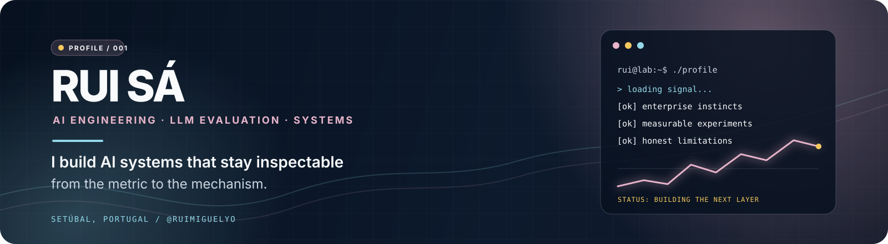
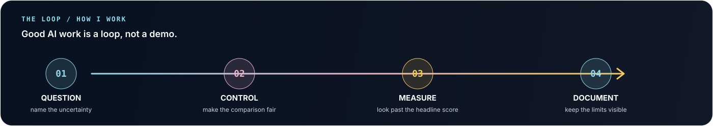

  <picture>
    <source media="(prefers-color-scheme: dark)" srcset="./assets/profile-header.svg">
    <source media="(prefers-color-scheme: light)" srcset="./assets/profile-header.svg">
  
  </picture>

  
  
  

  <a href="#what-i-build">what I build</a> &nbsp;&middot;&nbsp;
  <a href="#featured-work">featured work</a> &nbsp;&middot;&nbsp;
  <a href="#toolbox">toolbox</a> &nbsp;&middot;&nbsp;
  <a href="#contact">contact</a>

<h2 id="what-i-build">A bridge between enterprise software and inspectable AI</h2>

  I am <strong>Rui Sá</strong>, a Computer Engineering student in Setúbal, Portugal, moving deliberately into AI Engineering. I spent 4.5 years at Deloitte building and debugging SAP/ABAP systems, and I now apply that same discipline to language models: define the question, control the comparison, measure the behaviour, and document the limits.

<blockquote>
  <strong>I build AI systems that can be inspected from the metric to the mechanism.</strong>
</blockquote>

<table>
  <tr>
    <td align="center" width="25%"><strong>4.5 years</strong> enterprise software</td>
    <td align="center" width="25%"><strong>3.3M</strong> model parameters</td>
    <td align="center" width="25%"><strong>36 cases</strong> bilingual evaluation set</td>
    <td align="center" width="25%"><strong>10 tests</strong> JAX lab checks</td>
  </tr>
</table>

  

<h2 id="featured-work">Featured work</h2>

<table>
  <tr>
    <td valign="top" width="50%">
      <h3><a href="https://github.com/ruimiguelyo/jax-language-model-lab">JAX Language Model Lab</a></h3>
      
<strong>Decoder-only Transformer &middot; continual pretraining</strong>

      
A small language-model training stack built from the mechanism up instead of hiding behind a pretrained API. It compares sequential adaptation, reservoir replay and a joint-training reference under a fixed token budget.

      

        
        
        
        
      

      
<a href="https://github.com/ruimiguelyo/jax-language-model-lab">source code&nbsp;↗</a> &nbsp; <a href="https://github.com/ruimiguelyo/jax-language-model-lab/blob/main/README.md#results">results&nbsp;↗</a>

    </td>
    <td valign="top" width="50%">
      <h3><a href="https://github.com/ruimiguelyo/judgeshift-cx">JudgeShift CX</a></h3>
      
<strong>LLM-as-a-judge evaluation platform</strong>

      
A bilingual benchmark and dashboard for testing whether LLM judges can be trusted. It makes order sensitivity, confidence, coverage, cross-language consistency and failure modes visible instead of reducing them to one headline score.

      

        
        
        
        
      

      
<a href="https://ruimiguelyo.github.io/judgeshift-cx/">live dashboard&nbsp;↗</a> &nbsp; <a href="https://github.com/ruimiguelyo/judgeshift-cx/releases/tag/v0.1.0">v0.1.0 study&nbsp;↗</a>

    </td>
  </tr>
</table>

  
   
  One recorded experiment, one CPU device, one seed: the chart stays because honest limitations are part of the result.

<h2>What I am working on</h2>

<table>
  <tr>
    <td valign="top" width="50%">
      <h3>Now / 2026</h3>
      <ul>
        <li>Language-model training, evaluation and continual learning.</li>
        <li>LLM agents with explicit measurements and useful abstention.</li>
        <li>Reproducible experiments where negative results are still informative.</li>
      </ul>
    </td>
    <td valign="top" width="50%">
      <h3>Before / 2021&ndash;2026</h3>
      <ul>
        <li>Developer at Deloitte working with SAP and ABAP.</li>
        <li>Functional analysis, requirements, debugging and root-cause work.</li>
        <li>Testing, technical documentation and multidisciplinary delivery.</li>
      </ul>
    </td>
  </tr>
</table>

<h2 id="toolbox">Toolbox</h2>

  
  
  
  
  
  

  
<strong>Engineering detail</strong> &mdash; the tools behind the work

   
  <table>
    <tr><td><strong>AI / ML</strong></td><td>JAX, Flax, Optax, PyTorch, Transformers, Qwen, NLP, generative AI, causal Transformers</td></tr>
    <tr><td><strong>Evaluation</strong></td><td>Braintrust, golden datasets, order swaps, Wilson intervals, Cohen's kappa, stress tests</td></tr>
    <tr><td><strong>Software</strong></td><td>Python, TypeScript, React, Pydantic, Typer, pytest, MyPy, Ruff, Vite, JSONL</td></tr>
    <tr><td><strong>Enterprise</strong></td><td>SAP, ABAP, functional analysis, requirements, debugging, testing, documentation</td></tr>
  </table>

  
<strong>Other builds</strong> &mdash; beyond the main research thread

   
  <ul>
    <li><a href="https://github.com/ruimiguelyo/splitfx"><strong>SplitFX</strong></a> &mdash; explainable cross-currency settlements built with React and TypeScript.</li>
    <li><a href="https://github.com/ruimiguelyo/candidaturas-ai-scraper"><strong>Candidaturas AI Scraper</strong></a> &mdash; a local, transparent job-search workflow that exports deduplicated results.</li>
  </ul>

  
<strong>Live GitHub signal</strong> &mdash; updated from public activity

   
  

    <picture>
      <source media="(prefers-color-scheme: dark)" srcset="https://github-profile-summary-cards.vercel.app/api/cards/stats?username=ruimiguelyo&amp;theme=github_dark&amp;hide_border=true&amp;bg_color=00000000&amp;title_color=E8B4CA&amp;text_color=CBD5E1&amp;icon_color=93D8E8">
      <source media="(prefers-color-scheme: light)" srcset="https://github-profile-summary-cards.vercel.app/api/cards/stats?username=ruimiguelyo&amp;theme=default&amp;hide_border=true&amp;bg_color=00000000&amp;title_color=9B496A&amp;text_color=334155&amp;icon_color=167B8F">
      
    </picture>
    <picture>
      <source media="(prefers-color-scheme: dark)" srcset="https://github-profile-summary-cards.vercel.app/api/cards/repos-per-language?username=ruimiguelyo&amp;theme=github_dark&amp;hide_border=true&amp;bg_color=00000000&amp;title_color=E8B4CA&amp;text_color=CBD5E1&amp;icon_color=93D8E8">
      <source media="(prefers-color-scheme: light)" srcset="https://github-profile-summary-cards.vercel.app/api/cards/repos-per-language?username=ruimiguelyo&amp;theme=default&amp;hide_border=true&amp;bg_color=00000000&amp;title_color=9B496A&amp;text_color=334155&amp;icon_color=167B8F">
      
    </picture>
  

  
Public activity only. The project metrics above are the signal I use to describe the work.

<h2 id="contact">Let's build something measurable</h2>

  I am interested in ML/AI engineering roles and collaborations where software quality, model behaviour and evaluation matter. If you are working on reliable AI, language models, evaluation or agents, I would be glad to compare notes.

  <a href="mailto:ruimiguelsa.stb@gmail.com"><strong>email</strong></a> &nbsp;&middot;&nbsp;
  <a href="https://www.linkedin.com/in/rui-s%C3%A1-1243162ab/"><strong>LinkedIn</strong></a> &nbsp;&middot;&nbsp;
  <a href="https://github.com/ruimiguelyo"><strong>GitHub</strong></a>

Profile README / maintained as a living lab notebook.

