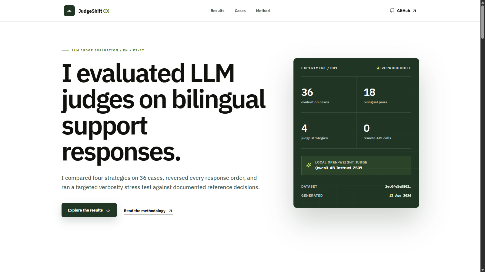
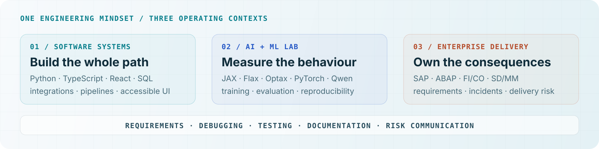

  <picture>
    <source media="(max-width: 600px) and (prefers-color-scheme: dark)" srcset="./assets/hero-mobile-dark.svg">
    <source media="(max-width: 600px) and (prefers-color-scheme: light)" srcset="./assets/hero-mobile-light.svg">
    <source media="(prefers-color-scheme: dark)" srcset="./assets/hero-dark.svg">
    <source media="(prefers-color-scheme: light)" srcset="./assets/hero-light.svg">
    
  </picture>

  <a href="https://ruimiguelyo.github.io/judgeshift-cx/"><strong>LIVE PROJECT ↗</strong></a>
  &nbsp;&nbsp;·&nbsp;&nbsp;
  <a href="https://www.linkedin.com/in/rui-s%C3%A1-1243162ab/"><strong>LINKEDIN ↗</strong></a>
  &nbsp;&nbsp;·&nbsp;&nbsp;
  <a href="mailto:ruimiguelsa.stb@gmail.com"><strong>EMAIL ↗</strong></a>

  <a href="#user-content-selected-systems">selected systems</a> &nbsp;·&nbsp;
  <a href="#user-content-engineering-range">engineering range</a> &nbsp;·&nbsp;
  <a href="#user-content-enterprise-foundation">enterprise foundation</a> &nbsp;·&nbsp;
  <a href="#user-content-lets-talk">contact</a>

## I build reliable software across product, AI and enterprise systems.

I am **Rui Sá**, a software developer and Computer Engineering student in Setúbal, Portugal. I spent 4.5 years full-time at Deloitte Portugal across SAP ABAP development and functional consulting, then carried that enterprise discipline into hands-on software and AI/ML projects.

That range is the point: I can move from business requirements and incident investigation to Python pipelines, TypeScript interfaces and language-model experiments while keeping tests, measurement and documentation visible.

> **My edge is turning ambiguous systems into work that can be inspected, reproduced and explained.**

<table>
  <tr>
    <td width="50%"><strong>4.5 years</strong> full-time enterprise software at Deloitte</td>
    <td width="50%"><strong>36 evaluation cases</strong> 18 bilingual pairs in JudgeShift CX</td>
  </tr>
  <tr>
    <td width="50%"><strong>20,480 tokens</strong> controlled continual-pretraining experiment</td>
    <td width="50%"><strong>144 ECTS</strong> completed in Computer Engineering</td>
  </tr>
</table>

<h2 id="selected-systems">Selected systems</h2>

  

### 01 / [JudgeShift CX](https://github.com/ruimiguelyo/judgeshift-cx)

`Python` `TypeScript` `React` `Braintrust` `Qwen`

A bilingual LLM-as-a-judge evaluation platform built to test when automated judges can be trusted - and when they should abstain. I created a traceable 36-case golden dataset, four judge strategies, reversed A/B order, agreement and coverage metrics, Wilson intervals, Cohen's kappa, parser repairs and cross-language checks.

**Engineering signal:** in a verbosity stress test, a length baseline fell from 100% to 0% agreement while the rubric judge retained 97.2%.

[Live dashboard ↗](https://ruimiguelyo.github.io/judgeshift-cx/) · [Source ↗](https://github.com/ruimiguelyo/judgeshift-cx) · [Methodology ↗](https://github.com/ruimiguelyo/judgeshift-cx/blob/main/docs/METHODOLOGY.md) · [v0.1.0 study ↗](https://github.com/ruimiguelyo/judgeshift-cx/releases/tag/v0.1.0)

---

### 02 / [JAX Language Model Lab](https://github.com/ruimiguelyo/jax-language-model-lab)

`Python` `JAX` `Flax` `Optax` `Transformers`

A decoder-only Transformer and training stack built from the mechanism up: causal attention, tied embeddings, JIT-compiled training, masked perplexity, checkpoints and automated tests. The continual-pretraining study compares sequential adaptation, Algorithm R reservoir replay and joint training under the same token budget.

**Engineering signal:** 3,320,128 parameters, a 20,480-token adaptation budget and explicit measurements of target learning, general-domain retention and forgetting.

[Live results ↗](https://jax-language-model-lab.pages.dev/) · [Source ↗](https://github.com/ruimiguelyo/jax-language-model-lab) · [Results ↗](https://github.com/ruimiguelyo/jax-language-model-lab/blob/main/README.md#results) · [Reproduce the runs ↗](https://github.com/ruimiguelyo/jax-language-model-lab/blob/main/README.md#reproducing-the-runs)

---

### 03 / [SplitFX](https://github.com/ruimiguelyo/splitfx)

`TypeScript` `React` `Redux Toolkit` `Jest` `Cypress`

An explainable cross-currency settlement app designed around the details quick demos usually hide: money stored in minor units, derived balances, predictable settlement rules, awkward UI states, accessibility and end-to-end browser journeys.

**Engineering signal:** strict TypeScript, unit and end-to-end tests, GitHub Actions and architecture decisions documented beside the code.

[Live app ↗](https://ruimiguelyo.github.io/splitfx/) · [Source ↗](https://github.com/ruimiguelyo/splitfx) · [Architecture ↗](https://github.com/ruimiguelyo/splitfx/tree/main/docs/architecture)

---

### 04 / [Candidaturas AI Scraper](https://github.com/ruimiguelyo/candidaturas-ai-scraper)

`Python` `Pydantic` `AsyncIO` `GitHub Actions` `CSV / JSON`

An evidence-first job-search workflow that searches multiple sources, deduplicates roles, explains filtering decisions and exports privacy-conscious results. It is built as a practical data pipeline rather than a black-box recommendation feed.

**Engineering signal:** automated tests cover business rules, pagination, partial failures, privacy-safe exports, CSV formula injection and digest generation; CI and the daily workflow run on GitHub Actions.

[Source ↗](https://github.com/ruimiguelyo/candidaturas-ai-scraper) · [Latest Actions ↗](https://github.com/ruimiguelyo/candidaturas-ai-scraper/actions)

<h2 id="engineering-range">Engineering range</h2>

  <picture>
    <source media="(max-width: 600px) and (prefers-color-scheme: dark)" srcset="./assets/stack-mobile-dark.svg">
    <source media="(max-width: 600px) and (prefers-color-scheme: light)" srcset="./assets/stack-mobile-light.svg">
    <source media="(prefers-color-scheme: dark)" srcset="./assets/stack-dark.svg">
    <source media="(prefers-color-scheme: light)" srcset="./assets/stack-light.svg">
    
  </picture>

  
<strong>Open the full technical index</strong>

   
  <table>
    <tr><th scope="row">Languages</th><td>Python, TypeScript/JavaScript, ABAP, SQL, Java, HTML/CSS</td></tr>
    <tr><th scope="row">AI / ML</th><td>JAX, Flax, Optax, PyTorch, Hugging Face Transformers, Qwen, causal Transformers, continual pretraining, reservoir replay, LLM evaluation</td></tr>
    <tr><th scope="row">Product engineering</th><td>React, Redux Toolkit, Pydantic, Typer, Vite, JSON/JSONL, accessible UI, domain modelling</td></tr>
    <tr><th scope="row">Quality</th><td>pytest, Jest, Cypress, MyPy, Ruff, GitHub Actions, reproducible runs, test documentation</td></tr>
    <tr><th scope="row">Enterprise</th><td>SAP FI/CO, SD/MM, MM/SRM, ABAP development, debugging, requirements analysis, impact assessment</td></tr>
  </table>

<h2 id="enterprise-foundation">Enterprise foundation</h2>

At Deloitte, software was never just code: it had billing, finance, purchasing, users, incidents, tests, risks and deadlines attached. That experience is the engineering foundation I bring to every stack.

**Deloitte Portugal** · SAP ABAP Developer & Functional Consultant · **Oct 2021 - Mar 2026**

- Developed and maintained ABAP solutions from functional requirements and business needs.
- Worked across FI/CO and SD/MM billing and financial integration, plus MM/SRM purchasing processes.
- Investigated incidents through functional analysis, debugging and root-cause analysis.
- Assessed change impact, tested solutions, documented decisions and communicated delivery risks across multidisciplinary teams.

  
<strong>Education and current trajectory</strong>

   
  
<strong>BSc in Computer Engineering · Polytechnic Institute of Setúbal · expected 2027</strong> 
  144 ECTS completed with a current average of 14/20. Current work includes Python, machine learning and data, NLP/generative AI and computer vision.

  
<strong>CTeSP in Software Engineering · Polytechnic Institute of Setúbal · completed 2023</strong> 
  120 ECTS completed with a final average of 15/20, including Java, JavaScript, Python and SQL.

## How I work

**Understand the system → make assumptions explicit → build the smallest honest solution → test the edges → document what remains.**

That loop is the common thread between enterprise incidents, product code and model experiments.

<h2 id="lets-talk">Let's talk</h2>

I am interested in software engineering and AI systems work where reliability, model behaviour and clear technical decisions matter. If that sounds like your kind of problem, I would be glad to compare notes.

  <a href="mailto:ruimiguelsa.stb@gmail.com"><strong>EMAIL</strong></a>
  &nbsp;&nbsp;·&nbsp;&nbsp;
  <a href="https://www.linkedin.com/in/rui-s%C3%A1-1243162ab/"><strong>LINKEDIN</strong></a>
  &nbsp;&nbsp;·&nbsp;&nbsp;
  <a href="https://github.com/ruimiguelyo?tab=repositories"><strong>ALL REPOSITORIES</strong></a>

Setúbal, Portugal · engineering logbook maintained by Rui Sá

